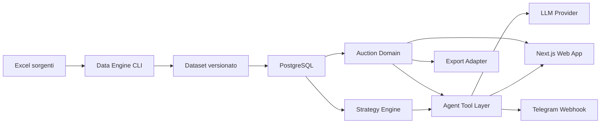

# Coach Beard — Product Requirements Document

**Stato:** Draft per approvazione  
**Data:** 18 agosto 2026  
**Owner:** Lorenzo Capone  
**Release target:** MVP operativo per l'asta, single-user  
**Nome di lavoro:** Coach Beard

## 1. Executive Summary

### Problem Statement

Durante un'asta di Fantacalcio lunga e ad alta pressione, un singolo fantallenatore deve contemporaneamente valutare i calciatori, ricordare informazioni provenienti da fonti differenti, controllare rose e crediti di otto partecipanti e adattare la propria strategia in tempo reale. Fogli di calcolo e chat generaliste non offrono uno stato dell'asta affidabile né raccomandazioni aggiornate dopo ogni acquisto.

### Proposed Solution

Coach Beard sarà una web app privata, responsive e interrogabile anche tramite Telegram. Un motore dati server-side prepara in anticipo il listone ufficiale, i prezzi storici, i consigli degli esperti e gli abbinamenti suggeriti; durante l'asta, un registro deterministico aggiorna acquisti, rose e crediti, mentre un agente AI usa esclusivamente lo stato e le fonti disponibili per consigliare offerte, alternative e prossime chiamate. L'utente rimane sempre il decisore finale.

### Success Criteria

- Registrare il 100% degli acquisti di una simulazione completa senza duplicati, crediti negativi o slot di rosa non validi.
- Rendere ricercabile un calciatore in meno di 150 ms al p95 e registrare un acquisto confermato in meno di 700 ms al p95, esclusa la latenza di rete del dispositivo.
- Rispondere correttamente al 100% di un benchmark di almeno 50 domande fattuali su proprietari, prezzi, rose, slot e crediti.
- Generare una raccomandazione strategica aggiornata entro 5 secondi al p95 dopo ogni acquisto.
- Completare le operazioni principali da mobile e desktop: selezione del calciatore, scelta dell'acquirente, prezzo e conferma.
- Produrre un file Excel e un CSV che superino la validazione interna e siano importabili in Leghe Fantacalcio usando il relativo template di importazione.
- Superare una prova generale end-to-end prima dell'asta: caricamento server-side delle fonti, asta simulata, interrogazione web/Telegram, correzione di un errore ed esportazione finale.

## 2. User Experience & Functionality

### User Personas

#### Fantallenatore-owner

Lorenzo è l'unico utente autorizzato nella v1. Usa Coach Beard da laptop durante l'asta e Telegram come canale secondario da telefono. Ha dimestichezza con strumenti digitali, ma durante l'asta deve poter agire rapidamente e senza configurazioni tecniche.

#### Operatore tecnico

Prepara le fonti prima del deploy, esegue il motore di ingestione, verifica il report di qualità, configura i secret e attiva la versione del dataset. Non è una persona o un ruolo visibile nell'applicazione.

### Core Product Principles

1. **Registro prima dell'AI:** acquisti, crediti e rose sono calcolati dal backend, mai dalla memoria del modello.
2. **Human in control:** Coach Beard consiglia, ma non compra, non rilancia e non assegna autonomamente un calciatore.
3. **Velocità sotto pressione:** la registrazione di un acquisto deve richiedere poche azioni e supportare tastiera e touch.
4. **Spiegabilità:** ogni raccomandazione mostra i fattori principali e le fonti utilizzate.
5. **Correggibilità:** ogni operazione è tracciata e può essere annullata attraverso un evento compensativo.
6. **Dataset stabile:** all'avvio dell'asta viene bloccata una versione delle fonti, che non può cambiare durante la sessione live.

### Primary User Flow

1. L'operatore esegue il Data Engine sui file sorgente e attiva un dataset validato.
2. Lorenzo accede alla web app privata e configura nomi degli otto partecipanti e propria squadra.
3. Coach Beard mostra listone, prezzi storici, consigli, abbinamenti e strategia iniziale.
4. Lorenzo avvia l'asta; il sistema blocca regole e versione del dataset.
5. Quando viene chiamato un calciatore, Lorenzo lo cerca e lo imposta come chiamata corrente.
6. Coach Beard mostra profilo, fascia di prezzo, decisione operativa, alternative e prossima chiamata suggerita.
7. Al termine della chiamata, Lorenzo registra acquirente e prezzo oppure segna il calciatore come invenduto.
8. Il backend aggiorna in transazione stato, rose, crediti, slot e audit log.
9. L'agente ricalcola raccomandazioni e ordine delle prossime chiamate.
10. Lorenzo interroga lo stato dalla chat web o da Telegram.
11. A fine asta il sistema valida tutte le rose ed esporta Excel e CSV.

### User Stories and Acceptance Criteria

#### Story 1 — Accesso privato

Come owner, voglio accedere in modo sicuro affinché dati e strategia non siano visibili agli altri partecipanti.

**Acceptance Criteria**

- L'accesso è consentito esclusivamente all'indirizzo email configurato nell'allowlist.
- Ogni route applicativa e API privata verifica sessione e owner ID lato server.
- Un visitatore non autenticato viene reindirizzato al login; un account non autorizzato riceve risposta 403.
- Il logout invalida la sessione attiva.

#### Story 2 — Dataset pronto all'apertura

Come owner, voglio trovare tutte le fonti già elaborate affinché non debba caricare o mappare file nell'app.

**Acceptance Criteria**

- Nell'interfaccia non esistono controlli di upload delle fonti.
- La dashboard mostra versione, data di generazione, conteggi e stato di validazione del dataset attivo.
- Il dataset contiene listone ufficiale, prezzi storici, consigli degli esperti e abbinamenti suggeriti.
- L'app non consente di iniziare l'asta se il dataset non è attivo o contiene errori bloccanti.
- Una sessione d'asta già iniziata continua a utilizzare la propria versione anche se viene preparata una versione successiva.

#### Story 3 — Configurazione della lega

Come owner, voglio configurare la lega affinché il sistema applichi correttamente vincoli e calcoli.

**Acceptance Criteria**

- La v1 supporta esattamente 8 partecipanti e identifica la squadra dell'owner.
- Ogni partecipante parte da 1.000 crediti.
- Ogni rosa prevede 3 portieri, 8 difensori, 8 centrocampisti e 6 attaccanti.
- L'ordine dei reparti è portieri, difensori, centrocampisti, attaccanti.
- Le regole memorizzano clean sheet del portiere e modificatore di difesa basato su portiere più i tre migliori difensori, attivo con almeno quattro difensori schierati.
- Nomi duplicati dei partecipanti e configurazioni incomplete impediscono l'avvio.

#### Story 4 — Ricerca e chiamata del calciatore

Come owner, voglio selezionare rapidamente il nome pronunciato affinché l'agente lavori sul giocatore corretto.

**Acceptance Criteria**

- La ricerca supporta nome, cognome, squadra e alias normalizzati.
- I risultati disponibili vengono mostrati prima dei calciatori già acquistati.
- Tastiera: digitazione, frecce, Invio per selezionare, Escape per annullare.
- Touch: target interattivi di almeno 44 px.
- Un calciatore acquistato non può diventare una nuova chiamata, salvo annullamento dell'acquisto precedente.
- Se il calciatore era la prossima chiamata raccomandata, l'agente ricalcola immediatamente le alternative.

#### Story 5 — Raccomandazione durante la chiamata

Come owner, voglio una decisione sintetica e motivata affinché possa scegliere rapidamente se rilanciare.

**Acceptance Criteria**

- La raccomandazione restituisce una delle azioni: `COMPRA`, `RILANCIA_FINO_A`, `PASSA`.
- `RILANCIA_FINO_A` include un valore massimo numerico che non viola il vincolo di almeno un credito per ogni slot ancora vuoto.
- La risposta mostra livello di confidenza, massimo consigliato, tre motivazioni al massimo e fonti principali.
- Il sistema considera almeno: rosa dell'owner, budget residuo, slot, disponibilità e scarsità del ruolo, storico, consigli, abbinamenti, preferenze personali e situazione degli avversari.
- Se il modello non risponde, i dati della scheda e il massimo deterministico restano disponibili.
- Nessuna risposta dell'agente modifica lo stato dell'asta.

#### Story 6 — Registrazione dell'acquisto

Come owner, voglio registrare acquirente e prezzo affinché tutte le strategie successive riflettano lo stato reale.

**Acceptance Criteria**

- L'operazione richiede calciatore corrente, acquirente e prezzo intero positivo.
- Il backend verifica disponibilità, crediti e slot di ruolo prima del commit.
- Acquisto, decremento crediti, aggiornamento rosa e audit event avvengono in un'unica transazione.
- Richieste duplicate con la stessa idempotency key non creano doppie assegnazioni.
- Dopo il commit tutte le viste e Telegram leggono lo stesso nuovo stato.
- Il sistema supporta anche `INVENDUTO`, che rende nuovamente disponibile il calciatore senza modificare crediti o rose.

#### Story 7 — Monitoraggio degli avversari

Come owner, voglio vedere chi ha comprato chi e con quanti crediti affinché possa sfruttare fabbisogni e vincoli degli avversari.

**Acceptance Criteria**

- Per ognuno degli otto partecipanti vengono mostrati crediti iniziali, spesi e residui.
- Sono visibili rosa, prezzo di ciascun acquisto, slot riempiti e slot liberi per ruolo.
- Viene calcolata la spesa massima teorica corrente preservando un credito per ogni slot vuoto.
- Le viste si aggiornano dopo ogni transazione senza ricaricare manualmente la pagina.
- Nessun totale mostrato viene calcolato dal modello linguistico.

#### Story 8 — Prossima chiamata consigliata

Come owner, voglio sapere chi chiamare successivamente affinché la mia strategia si adatti al mercato.

**Acceptance Criteria**

- Coach Beard propone una scelta principale e fino a due alternative ancora disponibili.
- Ogni suggerimento include obiettivo strategico, fascia di prezzo e avversari probabilmente interessati.
- Un calciatore chiamato o acquistato viene rimosso dall'elenco delle prossime chiamate.
- A parità di stato, dataset e configurazione strategica, l'ordinamento di base è deterministico.
- L'LLM spiega l'ordinamento ma non sceglie candidati che i filtri deterministici hanno escluso.

#### Story 9 — Chat web interrogabile

Come owner, voglio porre domande in linguaggio naturale affinché non debba navigare tra diverse tabelle durante l'asta.

**Acceptance Criteria**

- La chat risponde a domande su proprietari, prezzi, crediti, rose, slot, disponibilità, alternative e strategia.
- Le risposte fattuali sono costruite dai tool backend e includono timestamp dello stato letto.
- Le risposte strategiche distinguono chiaramente fatti, inferenze e raccomandazioni.
- Il modello non può eseguire query arbitrarie sul database; utilizza solo tool con schema validato.
- Ogni risposta conserva riferimenti agli eventi e alle fonti utilizzate per il debug.

#### Story 10 — Telegram

Come owner, voglio interrogare Coach Beard da Telegram affinché possa consultarlo rapidamente dal telefono.

**Acceptance Criteria**

- Il bot accetta messaggi esclusivamente dal Telegram user ID e chat ID autorizzati.
- Supporta linguaggio naturale e comandi equivalenti per stato, giocatore, proprietario, crediti, rosa e prossima chiamata.
- Nella v1 Telegram è in sola lettura: non registra acquisti e non modifica strategia o configurazione.
- Ogni risposta include lo stato aggiornato della medesima sessione usata dalla web app.
- Un webhook non autenticato o proveniente da un utente diverso viene scartato e registrato.
- I messaggi lunghi vengono sintetizzati in un formato leggibile su mobile.

#### Story 11 — Correzioni e audit log

Come owner, voglio correggere rapidamente un errore affinché il registro rimanga coerente.

**Acceptance Criteria**

- È disponibile l'azione `Annulla ultima operazione` con conferma esplicita.
- L'annullamento crea un evento compensativo e non elimina lo storico originale.
- Crediti, rosa, slot, disponibilità e raccomandazioni vengono ricalcolati atomicamente.
- L'audit log mostra timestamp, operazione, valori precedenti e successivi.
- Non è possibile annullare un evento se esistono dipendenze successive incompatibili senza prima annullare tali eventi.

#### Story 12 — Validazione ed esportazione

Come owner, voglio esportare l'asta affinché possa importarla in Leghe Fantacalcio senza ricopiare i dati.

**Acceptance Criteria**

- Prima dell'esportazione il sistema verifica unicità dei calciatori, ruoli, slot, crediti e completezza delle rose.
- Gli errori bloccanti sono mostrati con squadra, calciatore e correzione richiesta.
- Vengono generati un workbook Excel di riepilogo e un CSV UTF-8 conforme al template di importazione fornito da Leghe Fantacalcio.
- L'adapter di esportazione conserva esattamente ordine, intestazioni, separatore e formati richiesti dal template.
- Ogni export è associato a sessione, dataset version, checksum e timestamp.
- Reiterare l'export senza modifiche produce dati logicamente identici.

### Non-Goals

- Accesso contemporaneo degli altri sette partecipanti.
- Prodotto pubblico, gestione multi-tenant, pagamenti o abbonamenti.
- Scraping automatico o sincronizzazione live con Leghe Fantacalcio.
- Ascolto del microfono, riconoscimento vocale o registrazione automatica della stanza.
- Tracciamento di ogni singolo rilancio; la v1 registra chiamata, esito e prezzo finale.
- Modifiche del registro tramite Telegram.
- Acquisti o decisioni automatiche effettuate dall'agente.
- Aggiornamento delle fonti mentre una sessione d'asta è live.
- Consigli settimanali di formazione, monitoraggio infortuni e notifiche stagionali; previsti per una release successiva.

## 3. AI System Requirements

### System Boundary

Coach Beard utilizza un'architettura ibrida:

- **Motore deterministico:** disponibilità, vincoli, crediti, slot, storico dell'asta, filtri, massimo spendibile e ranking di base.
- **Agente AI:** interpreta domande, seleziona tool autorizzati, sintetizza evidenze e spiega raccomandazioni.
- **LLM provider adapter:** il provider è configurabile server-side; la v1 può utilizzare Claude come provider iniziale senza legare il dominio a una singola API.

Il modello non riceve credenziali, non scrive direttamente nel database e non può trasformare una propria risposta in un evento d'asta.

### Tool Requirements

L'agente può utilizzare esclusivamente tool tipizzati e validati:

| Tool | Responsabilità |
|---|---|
| `getAuctionState` | Restituisce sessione, fase, chiamata corrente e dataset version. |
| `searchPlayers` | Cerca calciatori e applica filtri di disponibilità, ruolo e squadra. |
| `getPlayerProfile` | Unisce listone, storico, consigli, abbinamenti e stato corrente. |
| `getManagerState` | Restituisce crediti, rosa, slot e spesa massima di un partecipante. |
| `getLeagueMatrix` | Confronta gli otto partecipanti senza esporre query SQL. |
| `calculateBidCeiling` | Calcola il massimo valido preservando i vincoli di completamento rosa. |
| `rankNextNominations` | Produce il ranking deterministico dei prossimi nomi disponibili. |
| `comparePlayers` | Confronta candidati sugli stessi fattori normalizzati. |
| `getSourceEvidence` | Recupera evidenze e provenienza per una raccomandazione. |

I tool di scrittura dell'asta sono utilizzati soltanto dalle API della web app dopo conferma esplicita, non dall'agente conversazionale.

### Recommendation Pipeline

1. Verifica dello stato e della versione del dataset.
2. Filtri duri: disponibilità, ruolo, slot, budget minimo residuo e preferenze di esclusione.
3. Calcolo di feature normalizzate: valore storico, consenso esperti, scarsità, fit della rosa, abbinamenti, preferenze, pressione avversaria e costo-opportunità.
4. Ranking deterministico con configurazione strategica versionata.
5. Calcolo del massimo sostenibile e del massimo raccomandato.
6. Generazione LLM di una spiegazione breve basata esclusivamente sui risultati precedenti.
7. Validazione dell'output con schema strutturato; in caso di errore viene mostrata la raccomandazione deterministica senza testo generativo.

### Structured Output Contract

Ogni raccomandazione deve validare il seguente contratto logico:

```json
{
  "action": "BUY | BID_UP_TO | PASS",
  "recommendedMaxBid": 0,
  "confidence": "LOW | MEDIUM | HIGH",
  "reasons": ["massimo tre motivazioni"],
  "alternatives": ["playerId"],
  "sourceRefs": ["sourceRecordId"],
  "auctionStateVersion": 0
}
```

Una risposta con `auctionStateVersion` precedente allo stato corrente viene scartata e ricalcolata.

### Evaluation Strategy

#### Dataset evaluation

- Il 100% delle righe del listone deve essere importato oppure comparire esplicitamente nel report degli scarti.
- Zero associazioni ambigue vengono attivate automaticamente: nomi non risolti bloccano l'attivazione del dataset.
- Prezzi, consigli e abbinamenti vengono verificati a campione contro almeno 30 record originali per fonte.
- Due esecuzioni sugli stessi file producono lo stesso checksum logico e non duplicano record.

#### Deterministic engine evaluation

- Test di proprietà per garantire crediti mai negativi, nessun doppio proprietario e slot mai oltre il limite.
- Test su ogni transizione di stato e relativo annullamento.
- Benchmark con almeno 50 query fattuali e risultato atteso esatto.
- Il massimo consigliato non deve mai superare il massimo legalmente spendibile.

#### Agent evaluation

- Almeno il 95% delle risposte deve validare lo schema al primo tentativo; il 100% deve produrre una risposta valida dopo fallback.
- Il 100% delle affermazioni numeriche deve corrispondere all'output di un tool.
- Il 100% delle raccomandazioni deve escludere calciatori non disponibili o incompatibili.
- Almeno il 90% di un set di 30 domande strategiche deve contenere una motivazione pertinente e almeno una evidenza disponibile.
- Test di prompt injection sulle note degli esperti: il testo importato è trattato come dato non affidabile e non può modificare istruzioni o tool policy.
- Esecuzione shadow su un'asta storica, confrontando suggerimenti, prezzi effettivi e violazioni di budget.

## 4. Technical Specifications

### Architecture Overview

La v1 sarà un **modular monolith serverless**: una sola applicazione TypeScript con moduli di dominio isolati, deployata su Vercel e collegata a PostgreSQL gestito. Questa scelta minimizza il tempo di consegna e i punti di errore, mantenendo confini sufficienti per separare i servizi in futuro.



#### Selected stack

- **Frontend e backend:** Next.js App Router, React e TypeScript.
- **Hosting:** Vercel.
- **Database e autenticazione:** Supabase PostgreSQL e Supabase Auth.
- **Validazione:** schema validation condivisa tra API, dominio e ingestione.
- **File Excel/CSV:** parser server-side con adapter dedicati per ogni fonte e adapter separato per l'export Leghe.
- **AI:** provider adapter server-side; Claude come configurazione iniziale.
- **Telegram:** Telegram Bot API tramite webhook HTTPS firmato.
- **Styling:** design system responsive con componenti accessibili; nessuna dipendenza dell'agente dalla UI.

#### Alternatives considered

- **Microservizi separati:** migliore isolamento teorico, ma deploy, osservabilità e consistenza distribuita non sono giustificati per un singolo utente e una consegna immediata.
- **Applicazione solo client con file locali:** più veloce da prototipare, ma espone dati e chiavi, rende fragile Telegram e non garantisce transazioni o audit.
- **Modular monolith selezionato:** offre transazioni, un unico deploy e moduli separabili senza complessità operativa prematura.

### Application Modules

| Modulo | Responsabilità | Dipendenze consentite |
|---|---|---|
| `data-ingestion` | Legge Excel, normalizza, valida e pubblica dataset versionati. | Database, parser Excel, schema dominio. |
| `catalog` | Ricerca e profilo canonico del calciatore. | Dataset attivo. |
| `league` | Partecipanti, regole, crediti iniziali e vincoli rosa. | Database. |
| `auction` | Macchina a stati, acquisti, invenduti, undo e audit. | League, catalog, database. |
| `strategy` | Filtri, feature, ranking, massimo spendibile e prossime chiamate. | Auction, catalog. |
| `agent` | Tool calling, output strutturato, evidenze e fallback. | Catalog, auction, strategy, LLM adapter. |
| `telegram` | Autorizzazione e presentazione mobile delle query. | Agent; nessuna scrittura auction in v1. |
| `export` | Validazione finale e generazione Excel/CSV. | Auction, league, catalog. |

### Data Ingestion Engine

Il Data Engine viene eseguito fuori dall'interfaccia utente attraverso un comando amministrativo locale o CI protetto.

1. Calcola hash dei file sorgente e registra manifest, fogli e conteggi.
2. Applica un adapter per ciascun workbook, senza dipendere dalla posizione fissa delle colonne.
3. Normalizza stringhe, accenti, apostrofi, abbreviazioni, squadre e ruoli.
4. Risolve l'identità del calciatore usando nome normalizzato, squadra, ruolo e alias espliciti.
5. Produce un report con errori bloccanti, warning e righe escluse.
6. Scrive in una nuova `dataset_version` senza modificare quella attiva.
7. Attiva la versione soltanto con zero errori bloccanti.
8. Mantiene i file grezzi fuori dal bundle pubblico e non li espone tramite route applicative.

Una sessione live conserva il riferimento alla versione con cui è iniziata. Un nuovo dataset può essere preparato, ma sarà utilizzabile soltanto da una nuova sessione.

### Canonical Data Model

| Entità | Campi principali |
|---|---|
| `users` | owner ID, email, stato allowlist. |
| `leagues` | nome, owner, stato configurazione. |
| `league_rules` | crediti, slot per ruolo, ordine reparti, scoring e modificatore. |
| `managers` | lega, nome, nome squadra, flag owner. |
| `dataset_versions` | hash, stato, conteggi, validation report, activated at. |
| `players` | canonical ID, nome, alias, ruolo, squadra, dataset version. |
| `historical_prices` | player ID, prezzo, asta/stagione, fonte. |
| `expert_recommendations` | player ID, giudizio, testo, punteggio normalizzato, fonte. |
| `player_pairings` | player A, player B, tipo, forza, fonte. |
| `strategy_preferences` | pupilli, esclusioni, limiti reparto, configurazione ranking. |
| `auction_sessions` | lega, dataset version, stato, reparto corrente, state version. |
| `auction_events` | sequence ID, tipo, payload, timestamp, compensates event ID. |
| `nominations` | sessione, player ID, stato, nominato da, timestamp. |
| `purchases` | sessione, player ID, manager ID, prezzo, source event ID. |
| `agent_runs` | domanda, tool call, evidenze, output, state version, latenza. |
| `telegram_bindings` | owner, user ID, chat ID, stato. |
| `export_runs` | sessione, formato, checksum, validation result, timestamp. |

I saldi e gli slot possono essere materializzati per velocità, ma sono sempre ricostruibili dall'event log.

### Auction State Machine

Stati della sessione:

- `DRAFT`: configurazione modificabile.
- `READY`: configurazione e dataset validi.
- `LIVE`: dataset e regole bloccati; eventi d'asta abilitati.
- `PAUSED`: consultazione e correzioni abilitate, nuove chiamate disabilitate.
- `COMPLETED`: scritture bloccate, validazione ed export abilitati.

Transizioni principali:

- `START_AUCTION`
- `NOMINATE_PLAYER`
- `SELL_PLAYER`
- `MARK_UNSOLD`
- `COMPENSATE_EVENT`
- `CHANGE_ROLE_PHASE`
- `PAUSE_AUCTION`
- `RESUME_AUCTION`
- `COMPLETE_AUCTION`

Ogni comando richiede `expectedStateVersion`; una richiesta basata su uno stato vecchio fallisce con conflitto invece di sovrascrivere dati recenti.

### API Boundaries

- `GET /api/players/search`
- `GET /api/players/:id`
- `GET /api/auction/state`
- `POST /api/auction/start`
- `POST /api/auction/nominate`
- `POST /api/auction/sell`
- `POST /api/auction/unsold`
- `POST /api/auction/undo`
- `POST /api/auction/pause`
- `POST /api/auction/complete`
- `POST /api/agent/chat`
- `GET /api/strategy/next-nominations`
- `POST /api/exports`
- `POST /api/telegram/webhook`

Ogni endpoint di scrittura utilizza schema validation, autenticazione owner, idempotency key, transaction boundary e audit metadata.

### Integration Points

#### Vercel

- Deploy della web app e delle route server-side.
- Environment separati per sviluppo e produzione.
- Preview deployment senza accesso ai dati di produzione.

#### Supabase

- PostgreSQL come source of truth.
- Autenticazione con allowlist server-side.
- Row Level Security che limita ogni riga all'owner della lega.
- Backup e migrazioni versionate.

#### LLM provider

- API key disponibile solo server-side.
- Timeout per richiesta e un solo retry controllato.
- Output validato prima di essere mostrato.
- Circuit breaker: in caso di errore si conserva la piena operatività deterministica.

#### Telegram

- Webhook HTTPS configurato con secret token.
- Verifica Telegram user ID e chat ID.
- Rate limiting e deduplicazione tramite update ID.
- Nessuna esposizione dell'URL interno del database o delle credenziali.

#### Leghe Fantacalcio export

- Adapter basato sul template di importazione fornito.
- Test fixture che confronta esattamente intestazioni, ordine colonne, separatore, codifica e valori obbligatori.
- Nessuna dipendenza da scraping o API non documentate.

### Security & Privacy

- Tutti i secret sono conservati nelle environment variables del provider e mai nel repository o nel client bundle.
- Autenticazione, autorizzazione e RLS applicano una strategia deny-by-default.
- Il Telegram ID è trattato come identificatore privato e non viene incluso nei log applicativi in chiaro.
- I file Excel grezzi restano server-side e sono esclusi dagli asset pubblici.
- Le note provenienti dalle fonti sono dati non affidabili: non vengono concatenate alle istruzioni di sistema senza delimitazione e sanitizzazione.
- I log dell'agente non memorizzano token segreti e applicano retention configurata.
- Gli endpoint di scrittura hanno rate limiting, validazione, idempotenza e protezione CSRF dove applicabile.
- Il database applica vincoli univoci su `session + player`, check sui prezzi e foreign key su dataset e manager.
- Prima di un eventuale lancio pubblico sarà necessaria una verifica legale del nome “Coach Beard” e degli eventuali diritti sui dati. Nella v1 privata è considerato un nome di lavoro.

### Reliability, Performance and Recovery

- Ricerca calciatori: p95 inferiore a 150 ms sul dataset della stagione.
- Lettura stato asta: p95 inferiore a 300 ms.
- Commit acquisto: p95 inferiore a 700 ms.
- Risposta agente: p95 inferiore a 5 secondi; fallback deterministico entro 1 secondo dall'errore del provider.
- Risposta Telegram: p95 inferiore a 6 secondi.
- Disponibilità obiettivo durante la finestra d'asta: almeno 99,5%.
- Ogni acquisto è confermato all'utente soltanto dopo commit database.
- Retry client ammesso esclusivamente con idempotency key.
- Snapshot dello stato creato prima dell'avvio e al completamento di ogni reparto.
- Recovery testato ricostruendo rose e crediti dall'event log.

### Observability

- Log strutturati con request ID, session ID, state version e latenza.
- Metriche per errori di transazione, conflitti, risposte AI invalide, timeout, webhook rifiutati ed export falliti.
- Audit trail separato dai log tecnici.
- Health check per database, dataset attivo e configurazione Telegram.
- Nessun dato personale o contenuto completo delle fonti nei log di errore.

### Test Strategy

- **Unit test:** normalizzazione, vincoli, budget, slot, ranking, export mapping.
- **Property-based test:** invarianti di crediti, unicità dei calciatori e reversibilità degli eventi.
- **Integration test:** database transaction, auth, Telegram webhook, LLM output validation.
- **Contract test:** ogni adapter Excel e il template Leghe.
- **E2E test desktop/mobile:** login, chiamata, acquisto, undo, chat, completamento ed export.
- **Load/latency test:** sequenza completa di un'asta con 200 eventi e query concorrenti web/Telegram.
- **Disaster rehearsal:** indisponibilità LLM durante l'asta; il registro e le informazioni strutturate devono continuare a funzionare.

## 5. Risks & Roadmap

### Phased Rollout

#### MVP — Auction Day

- Data Engine server-side per le quattro fonti.
- Accesso single-user.
- Configurazione lega e regole.
- Listone ricercabile.
- Cockpit live con chiamata, acquisto, invenduto e undo.
- Rose, slot e crediti degli otto partecipanti.
- Scheda giocatore e massimo spendibile deterministico.
- Raccomandazione AI e prossima chiamata.
- Chat web.
- Telegram read-only.
- Validazione ed export Excel/CSV.
- Deploy Vercel e database production.

#### v1.1 — Season Assistant

- Aggiornamenti periodici delle fonti tra una giornata e l'altra.
- Analisi della formazione, infortuni, squalifiche e calendario.
- Messaggi Telegram proattivi e recap mensile.
- Memoria delle decisioni dell'owner e feedback sulle raccomandazioni.
- Dashboard sull'andamento stagionale e confronto agent-assisted vs risultati.

#### v2.0 — Multi-league Product

- Account e leghe multiple.
- Inviti e ruoli collaborativi.
- Configurazioni di regolamento personalizzabili.
- Onboarding self-service delle fonti consentite.
- Billing, quota di utilizzo e osservabilità multi-tenant.
- Branding pubblico subordinato a verifica legale.

### Technical Risks and Mitigations

| Rischio | Impatto | Mitigazione |
|---|---|---|
| Nomi differenti tra file | Dati associati al calciatore sbagliato | Resolver canonico, alias espliciti, blocco su ambiguità e report pre-attivazione. |
| Formato Leghe diverso dal previsto | Export non importabile | Template reale come fixture, adapter isolato e test di round-trip prima dell'asta. |
| Allucinazioni del modello | Consiglio o numero errato | Tool calling, numeri solo da tool, schema validation, evidenze e fallback deterministico. |
| Latenza o outage LLM | Decisione rallentata | Timeout, circuit breaker e UI sempre operativa con dati e calcoli locali al backend. |
| Doppio click o rete instabile | Doppio acquisto | Idempotency key, unique constraint e transaction. |
| Correzione tardiva | Stato derivato incoerente | Event sourcing leggero, eventi compensativi e ricostruzione automatica. |
| Operatore sovraccarico | Acquisti non registrati | Flusso a poche azioni, scorciatoie, chiamata corrente e prova generale. |
| Dataset modificato durante l'asta | Raccomandazioni non riproducibili | Dataset version bloccata nella sessione live. |
| Accesso Telegram non autorizzato | Esposizione della strategia | Secret webhook, allowlist user/chat ID, rate limiting e risposta neutra agli altri utenti. |
| Vercel o database indisponibile | Impossibilità di aggiornare l'asta | Health check, backup, snapshot per reparto e procedura di recovery documentata. |
| Licenza dei dati o nome del prodotto | Rischio legale in caso di pubblicazione | Uso privato nella v1; revisione di licenze e trademark prima di qualsiasi lancio pubblico. |

### Required Project Inputs

Prima dell'implementazione operativa devono essere disponibili nel workspace protetto:

- file Excel del listone ufficiale;
- file Excel dei prezzi storici;
- file Excel dei consigli degli esperti;
- file Excel degli abbinamenti suggeriti;
- template o esempio reale di importazione Leghe Fantacalcio;
- email allowlisted dell'owner;
- credenziali di progetto Vercel e Supabase;
- API key del provider LLM;
- token del bot Telegram e Telegram user/chat ID dell'owner.

Le credenziali non devono essere inserite nel PRD, nei file sorgente o nei messaggi di log.

### Definition of Ready for Implementation

- Il presente PRD è approvato dall'owner.
- Le quattro fonti e il template Leghe sono disponibili.
- È confermato che Telegram rimane read-only nella v1.
- È confermato che il dataset viene congelato all'avvio dell'asta.
- Sono disponibili gli account e i secret dei servizi selezionati.

### Definition of Done for MVP

- Tutti gli acceptance criteria dell'MVP sono coperti da test o prova documentata.
- Il Data Engine importa le fonti reali con zero errori bloccanti.
- Una simulazione con otto squadre completa almeno un reparto senza incoerenze.
- Il benchmark fattuale e gli eval dell'agente superano le soglie definite.
- Il bot Telegram risponde esclusivamente all'owner.
- L'export reale viene accettato dal flusso di importazione di Leghe Fantacalcio.
- La web app è deployata in produzione, protetta e utilizzabile da desktop e mobile.
- È documentata una procedura manuale di recovery qualora AI o Telegram non siano disponibili.
